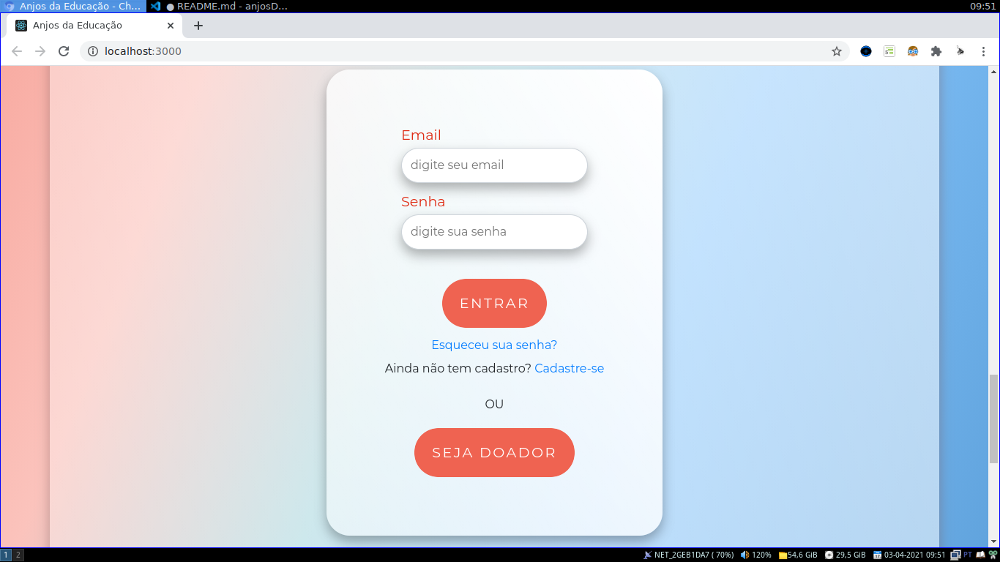
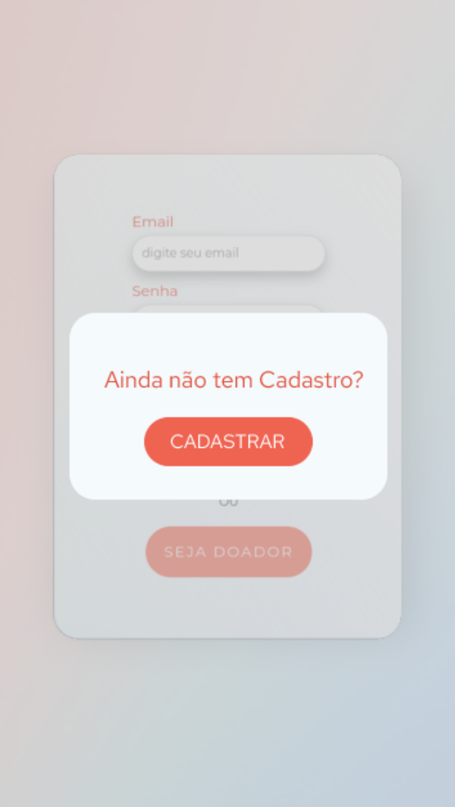
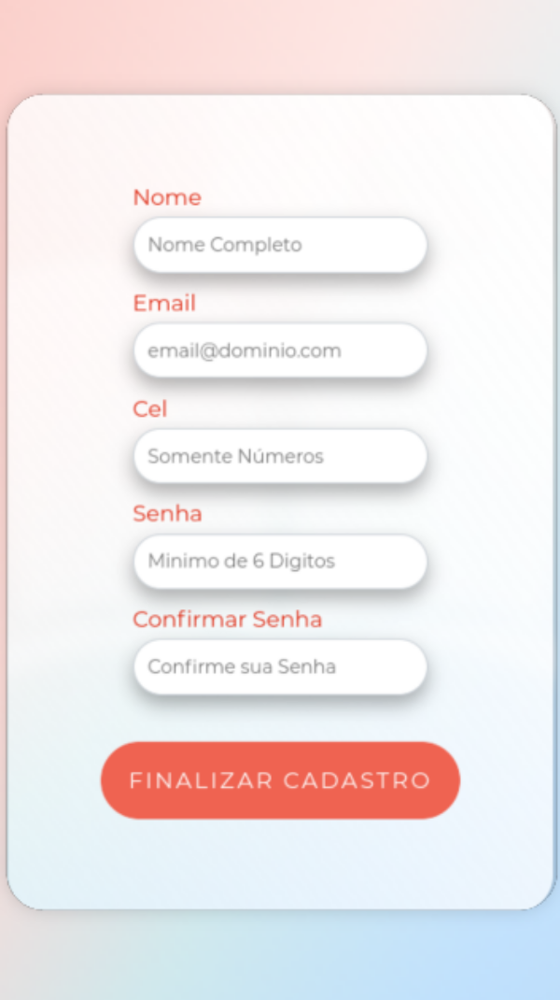
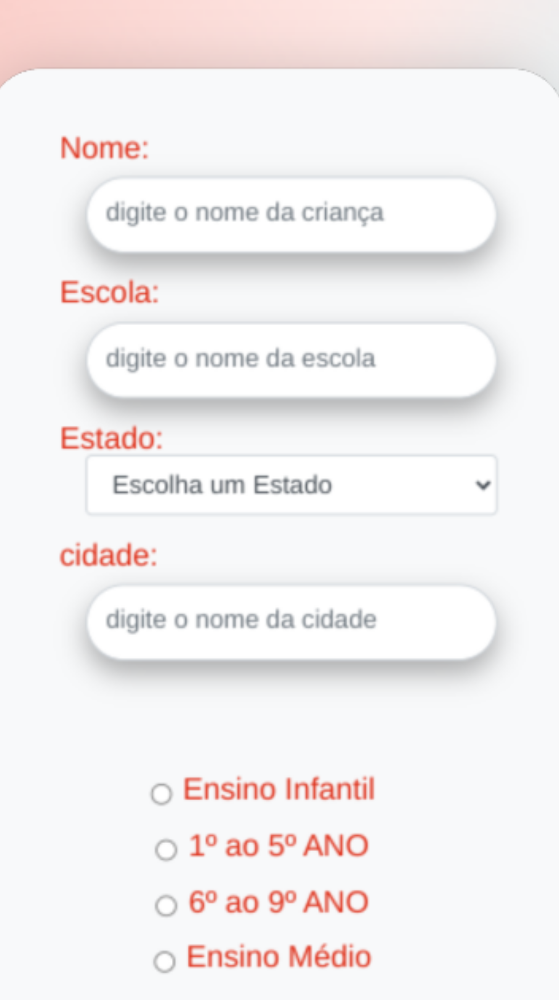
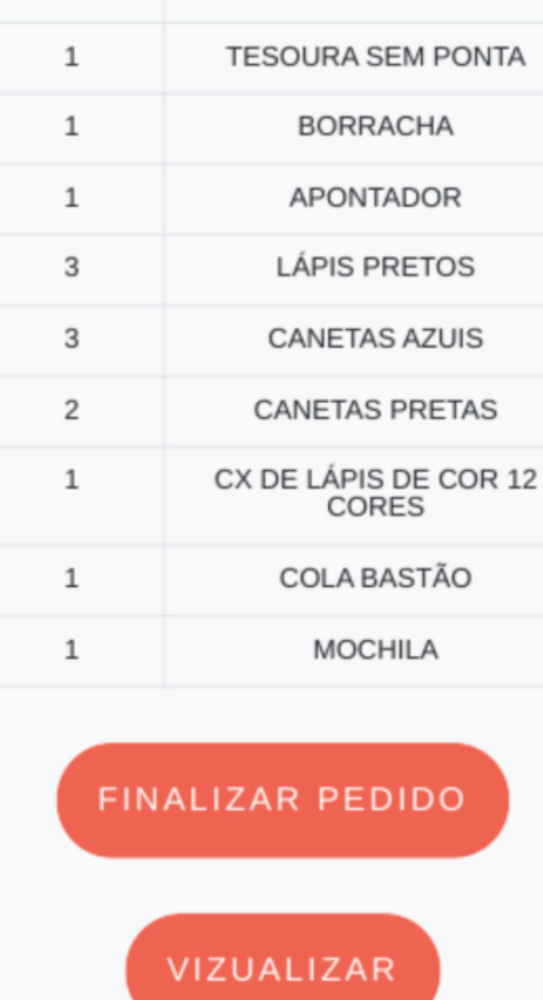
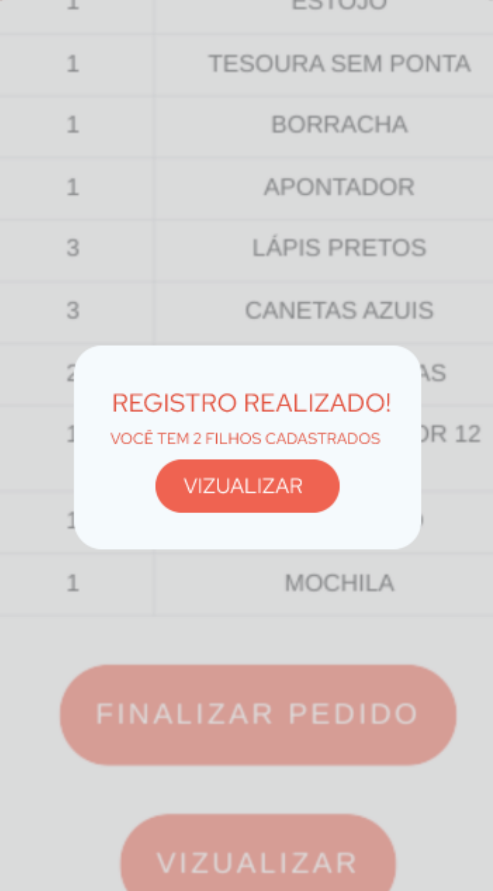

<h1 align="center">Anjos da Eduacação</h1>

<p align="center"></p>

<p align="center">A iniciativa desse projeto se deu a partir de um desafio do Hackaton proposto pelo Grupo <a target="_blank" href="https://digital.fcamara.com.br/programadeformacao">FCamara</a>.</p> 
<p align="center">A solução proposta é viabilizar doações de materiais escolares para crianças de escolas públicas. As doações iram acontecer em qualquer lugar de modo que o doador possa ajudar de forma online. Além do mais, as papelarias parceiras, que disponibilizam os materiais, terão maior visibilidade financeira e social. </p>

<hr>

<h2 align="center">Como Instalar</h2>

> **Clone o Repósitorio em sua máquina:**

```bash
git clone  https://github.com/wend3ll-souza/anjosDaEducacao.git
```

> **Navegue para o diretório que foi baixado:**

```bash
cd anjosDaEducacao
```

> **Instale as Dependências:**

```bash
npm install
```
_ou_

```bash
yarn install
```
> **Inicie a aplicação:**

```bash
npm start
```
_ou_

```bash
yarn start
```
**A aplicação irá iniciar em seu navegador, por padrão estará em:**

http://localhost:3000/

**Caso não estaja na porta 3000 confira no terminal que iniciou a aplicação para ver o caminho que está definido**


**Você também pode acessar o deploy da aplicação:**

<p align="center"><a href="https://anjos.herokuapp.com/" target="_blank"></a></p>

<hr>

<h2 align="center">Navegando pela plataforma</h2>


> **A aplicação está em construção, então qualquer usuário poderá logar, mesmo sem login e senha, para ver as telas que já temos implementadas.**

> **Ainda não é possível cadastrar ou fazer uma doação**

<hr>
<h3 align="center">Responsável pela criança</h3>

O usuário pode entrar na aplicação utilizando o formulário de login:

**End Point**: `/`

<p align="center"></p>

Caso o usuário não for cadastrado será direcionado para tela de cadastro:

<p align="center"></p>


**End Point**: `/parents`

<p align="center"></p>

Caso o usuário já tenha feito o cadastro será direcionado para página onde irá registrar a criança que precisa dos materiais. Sendo preciso nome, endereço da escola e série. A uma lista de matériais para cada ciclo de ensino.

**End Point**: `/parentDetails`

<p align="center"></p>

<p align="center"></p>


Logo após registrar uma criança, ou clicando em vizualizar o responsável poderá vizualizar as crianças que tem cadastradas

<p align="center"></p>


**End Point**: `/childDetails`

<p align="center"></p>


<hr>
<br>
<br>
<br>
<h3 align="center">Doador</h3>

Caso o usuário queira ajudar alguma criança, basta clicar no botão `Seja um doador` no formulário de Login:

<p align="center"></p>

Então o usuário será direcionado para lista de pedidos, onde poderá vizualizar as crianças que precisam de doações

**End Point**: `/wishList`

<p align="center"></p>

Ao clicar em `Doar` o doador será direcionado para página contente mais informações sobre o andamento da vaquinha daquela criança:

**End Point**: `/littleCow`

<p align="center"></p>

Então, usuário poderá escolher sua forma de pagamento, _por enquanto só tem o método cartão implementado_

Ao clicar em `próximo` o usuario irá para a página pedindo informações do cartão e valor a ser doado.


**End Point**: `/paymentForm`

<p align="center"></p>


Depois que finalizar a doação o úsuario poderá compartilhar a mensagem de colaborador em suas redes sociais e se quiser poderá enviar uma pequena carta que será entregue para criança justo aos materiais.

<br>
<br>
<br>
<br>


Os usuários poderem visitar o mural de depoimentos para casos de sucesso e mensagens deixadas pelas crianças

**End Point**: `/mural`

<p align="center"></p>
